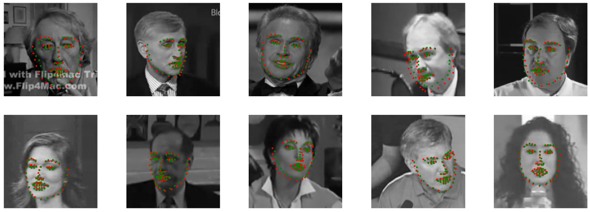

# Overview

In this project, I explore three different methods for facial keypoint detection using deep learning:

1. **Direct Coordinate Regression**  
2. **Transfer Learning**: Leveraging ResNet18 and DINO 
3. **Heatmap-based Keypoint Localization**

Our dataset consists of grayscale facial images paired with annotated keypoints. Each image is of size `224 x 224`, containing a single face with `68` annotated keypoints. Each keypoint is represented by its `(x, y)` coordinate in the 2D image space.

The goal is to predict the locations of all 68 keypoints given only the input facial image.

Below is a sample visualization of the dataset:

# Part 1: Direct Coordinate Regression

### Method

I first experimented with the most straightforward approach: directly regressing the coordinates of each facial keypoint. The model consists of a series of convolutional layers to extract features from the input image, followed by fully connected layers to predict the keypoints.

Given an input image, the network outputs a vector $\mathbf{y} \in \mathbb{R}^{2K}$, where $K = 68$ is the number of facial keypoints. Each keypoint is represented by its $(x, y)$ coordinates. I use the Smooth L1 loss between the predicted keypoints $\mathbf{y}$ and the ground truth keypoints $\mathbf{y}^*$:

#### Model Architecture
The CNN architecture includes multiple convolutional blocks with batch normalization and activation functions ELU, followed by a dropout layer and fully connected layers. The final output is a flattened vector of size 136.


### Training Details

- **Loss Function**: Smooth L1 Loss  
- **Optimizer**: Adam  
- **Learning Rate**: $1 \times 10^{-3}$  
- **Batch Size**: 8  
- **Epochs**: 20  
- **Final Model Epoch**: 16  

#### Training Curve

The figure below shows the training and validation loss curves during training:

*Left: Validation Curve. Right: Training Curve. The loss decreases steadily, and the model at epoch 16 was selected for evaluation.*

### Hyperparameter Analysis

I conducted experiments to evaluate the impact of different hyperparameters on performance:

- **Loss Functions**: MSELoss vs. Smooth L1 Loss  
- **Activations**: ReLU vs. ELU  
- **Learning Rates**: $1 \times 10^{-3}$ vs. $1 \times 10^{-4}$

The table below summarizes the results of these experiments, including the best performance achieved with each configuration, in terms of MSELoss on the test set:
| Loss Function | Activation | Learning Rate | MSE (Test Set) |
|---------------|------------|---------------|----------------|
| MSELoss       | ReLU       | $1 \times 10^{-3}$ | 0.0724       |
| MSELoss       | ELU        | $1 \times 10^{-3}$ | 0.1551       |
| Smooth L1     | ReLU       | $1 \times 10^{-3}$ | 0.1201       |
| Smooth L1     | ELU        | $1 \times 10^{-3}$ | **0.0629**       |
| MSELoss       | ReLU       | $1 \times 10^{-4}$ | 0.0758       |
| MSELoss       | ELU        | $1 \times 10^{-4}$ | 0.0939       |
| Smooth L1     | ReLU       | $1 \times 10^{-4}$ | 0.0708       |
| Smooth L1     | ELU        | $1 \times 10^{-4}$ | 0.0791       |

**Findings:**

- The choice between MSE and Smooth L1 resulted in similar training dynamics. But the result shows L1 loss will bring slightly better performance.
- ReLU and ELU both helped reduce training loss, but ReLU occasionally caused instability on the validation set. ELU offered more stable generalization and was therefore adopted.
- Changing the learning rate mainly affected the training curve; validation performance remained similar.


Thus I will use ELU activation and Smooth L1 loss for the final model and in following parts.

### Results and Visualization
Again, the best model finally get **0.0629** Mean Squared Error on test set. The figure below shows the predicted keypoints overlaid on the original image. The red dots represent the predicted keypoints, while the green dots represent the ground truth keypoints.

As image shows, the results aren't particularly good yet. Most of the center of the face can be predicted correctly, but it is not possible to accurately locate each keypoint

---

# Part 2: Transfer Learning

To improve performance with limited training data, I adopted transfer learning by leveraging pretrained models—specifically, **ResNet18** and **DINO**. I made light modifications to adapt these models to our facial keypoint detection task. Both models achieved strong performance.

## ResNet18

### Method
I started with the pretrained `resnet18` model from PyTorch. To adapt it for our grayscale facial images and keypoint prediction task, I made two key modifications:

1. **Input Layer**: Changed the first convolutional layer to accept a single-channel grayscale image instead of a 3-channel RGB image.
2. **Output Layer**: Replaced the final fully connected layer with a new one that outputs a vector of size `136` (68 keypoints × 2).

### Training Details

To take advantage of pretrained features, I used a two-stage training strategy:

- **Stage 1 (Epochs 0–4)**: Freeze all ResNet parameters except the first and last modified layers. Only train these new layers to adapt to the grayscale input and keypoint output.
- **Stage 2 (Epochs 5–N)**: Unfreeze the entire model and fine-tune all layers jointly on our dataset.

#### Training Hyperparameters

- **Loss Function**: Smooth L1 Loss  
- **Optimizer**: Adam  
- **Initial Learning Rate**: $1 \times 10^{-3}$  
- **Learning Rate Scheduler**: MultiStepLR (milestones at [10, 20], gamma = 0.5)
- **Batch Size**: 8  
- **Epochs**: 25  
- **Final Model Epoch**: 24

#### Training Curve

Below is the loss curve for the ResNet18 transfer learning setup:

*Left: Validation Curve. Right: Training Curve.*

### Results and Visualization
Finally, the best model achieved **0.0034** Mean Squared Error on the test set. The figure below shows the predicted keypoints overlaid on the original image. The red dots represent the predicted keypoints, while the green dots represent the ground truth keypoints.

The transfer learning approach using ResNet yields strong performance overall. Most keypoints are predicted accurately, especially around the eyes, nose, and mouth. However, minor inaccuracies still appear in the facial contour regions, such as the jawline and cheek areas.

## DINO
### Method

To explore the potential of transformer-based image representations, II experimented with **DINO** (self-supervised ViT backbone) as the feature extractor for keypoint regression. The DINO model outputs a tensor of shape `[B, N, D]`, where:

- `B`: Batch size  
- `N`: Number of tokens (patches + CLS)  
- `D`: Latent dimension

I use `vit_small_patch16_224_dino` model, so `N=197`, `D=384`. I tested two strategies to utilize the DINO features for predicting keypoints:

#### Strategy 1: Flatten and Regress

In the first strategy, I flattened the token outputs (excluding the CLS token) into a vector of shape `[B, (N-1) × D]`, and passed it through three fully connected layers to regress the final `68 × 2` keypoint coordinate vector. This mirrors the design in our direct regression baseline.

#### Strategy 2: Attention-style?

With the idea that a transformer must have more attention! I implemented a more structured approach:

1. Define a learnable **query matrix** $Q \in \mathbb{R}^{68 \times D}$, where each row corresponds to one keypoint.
2. Discard the CLS token from DINO output, use it as $K, V \in \mathbb{R}^{(N-1) \times D}$.
3. Compute keypoint-level attention using:

$$
A = \text{softmax} \left( \frac{QK^T}{\sqrt{D}} \right) \in \mathbb{R}^{68 \times (N-1)}
$$

4. Use $A$ to extract a representation for each keypoint from $V$:

$$
F = AV \in \mathbb{R}^{68 \times D}
$$

5. Pass each feature vector through a fully connected layer, make dimension decrease($D\rightarrow 2$) to regress the $(x, y)$ coordinate:

$$
\hat{\mathbf{y}}_k = W F_k + b
$$

This approach explicitly separates spatial reasoning for each keypoint and allows query-based learning over the image tokens.

#### Results

I tried both of two strategies, and **Strategy 2 consistently outperformed Strategy 1**. Meanwhile, the validation loss of the second strategy has been decreasing, very slowly but steadily all the time. Encouraged by this, I decided to give it a try! Trained the second model for 150 epochs.

### Training Details

- **Loss Function**: Smooth L1 Loss  
- **Optimizer**: Adam  
- **Learning Rate**: $1 \times 10^{-4}$  
- **Scheduler**: MultiStepLR (milestones = [20, 50, 70], gamma = 0.5)  
- **Frozen Training Epochs**: 10 (train only Q and FC layers)  
- **Batch Size**: 8  
- **Total Epochs**: 150  
- **Best Model Epoch**: 144

#### Training Curve

### Results and Visualization

Finally, the best model achieved **0.0080** Mean Squared Error on the test set. The figure below shows the predicted keypoints overlaid on the original image. The red dots represent the predicted keypoints, while the green dots represent the ground truth keypoints.

#### Discussion

Despite the simple design, the DINO-based model showed promising results. However, several limitations and opportunities for improvement exist:

1. **Static Query Matrix**: The same query matrix $Q$ was used for all images. Intuitively, this is suboptimal as different faces may require adaptive querying strategies.
2. **Shallow Output Mapping**: The final projection from $D = 384$ to 2 dimensions was performed with a single fully connected layer. A deeper decoder or hierarchical structure may enhance representational capacity.

I believe DINO has significant potential for keypoint detection. With more carefully crafted architecture and attention mechanisms, it could potentially outperform other methods.

## Comparison

While the DINO-based approach requires **longer training time** and **more architectural tuning**, it demonstrates strong representational power and generalization ability. In contrast, **ResNet-based transfer learning converges much faster and achieves strong results out-of-the-box**, making it a more accessible option when resources or time are limited.

In essence, I think models like DINO, which represent unsupervised or self-supervised pretraining approaches, tend to have this characteristic — they can be applied to many downstream tasks, but require careful and sophisticated design to fully unleash their power.

---

# Part 3: Heatmap-based Prediction

### Method

Unlike coordinate regression, this method predicts a **probability distribution** over the image space for each keypoint. Specifically, the model outputs $K = 68$ heatmaps, each representing the likelihood of a keypoint being at a particular position.

Each heatmap is of size $H' \times W'$, the predicted keypoint location is computed by taking the **argmax** of each heatmap and then mapping it back to the image coordinate space.

Let $H_k(u, v)$ be the predicted heatmap for keypoint $k$ at pixel location $(u, v)$. Then the predicted position $\hat{\mathbf{y}}_k = (x_k, y_k)$ is given by:

$$
(x_k', y_k') = \arg\max_{(u, v)} H_k(u, v)
$$
$$
(x_k, y_k) = \left(x_k'\cdot\frac{H}{H'}  , y_k'\cdot\frac{W}{W'} \right)
$$

Where $(H, w)$ are the original image dimensions. The scaling factors ensure that the predicted keypoint coordinates are in the same space as the original image.

#### Ground Truth Heatmap Generation

To train the model, I generate a 2D Gaussian heatmap for each keypoint in the ground truth. Given a keypoint located at $(x^\*_k, y^\*_k)$ in the image, it will locate in the heatmap at: 
$$
(x^\*_k', y^\*_k') = \left(x^\*_k\cdot\frac{H'}{H}  , y^\*_k\cdot\frac{W'}{W} \right)
$$

And then assign $G_k(x^\*_k', y^\*_k') = 1$, for other pixels assign 0. Then apply a Gaussian filter with standard deviation $\sigma$ to create a smooth heatmap.

#### Model Architeture

I adopt a standard **U-Net** architecture to predict 68 heatmaps at full resolution, i.e. $H' = H = 224$ and $W' = W = 224$.

- **Down Module**:
  - $2 \times 2$ max pooling with stride 2 (to reduce spatial size)
  - Two $3 \times 3$ convolutions (padding = 1), each followed by:
    - Batch Normalization
    - ELU activation
  - A dropout layer is added after the first convolution

- **Up Module**:
  - $2 \times 2$ transposed convolution (stride = 2) to upsample
  - Two $3 \times 3$ convolutions with batch norm and ELU
  - Skip connections are used to concatenate features from the corresponding down path

The model performs 4 downsampling steps and 4 upsampling steps. With each downsampling, the spatial resolution is halved and the feature dimension is doubled.

### Training Details

- **Ground Truth Heatmap Sigma $\sigma$**: 2.33  
- **Loss Function**: Cross Entropy Loss  
- **Optimizer**: Adam  
- **Learning Rate**: $1 \times 10^{-4}$  
- **Batch Size**: 8  
- **Epochs**: 60
- **Final Model Epoch**: 40
- **Hidden Layer**: 32->64->128->256->512->256->128->64->32

#### Training Curve

*Left: Validation Curve. Right: Training Curve.*

We can see the validation loss is quite low at 14 epochs, but the training loss is still decreasing, in order to see if it will be improved later, so I continued to training.

### Results and Visualization

The MSE on the test set is **0.0036**. The figure below shows the predicted keypoints overlaid on the original image. The red dots represent the predicted keypoints, while the green dots represent the ground truth keypoints.

And here are heatmaps for some keypoints, the first row shows the predicted heatmaps, and the second row shows the ground truth heatmaps.



### Discussion

While heatmap-based keypoint prediction has shown promising performance, training this type of model effectively can be non-trivial. Through some experimentation, I discovered several important factors that greatly influence training stability and accuracy:

#### 1. The Choice of Gaussian Sigma

The standard deviation $\sigma$ used to generate the ground truth heatmaps has a significant impact on training dynamics.

- A **larger $\sigma$** results in a wider area around the keypoint having non-zero values. This provides **more informative gradients** to the network, especially when the predicted location is close but not perfectly aligned with the ground truth.
- A **small $\sigma$**, in contrast, leads to very narrow peaks. When the model's prediction is slightly off, it receives little to no gradient feedback, making learning difficult.

The figure below shows the difference between two heatmaps generated with different $\sigma$ values:

*The middle one is generated with $\sigma=2.33$, the right one is generated with $\sigma=1.0$*

#### 2. Loss Function Choice and Heatmap Modeling

We evaluated three different loss functions for heatmap supervision:

- **MSELoss**
- **BCEWithLogitsLoss** (includes sigmoid internally)
- **CrossEntropyLoss** (includes softmax internally)

Among them, **CrossEntropyLoss** demonstrated the fastest convergence. The validation loss dropped sharply within the first few epochs, outperforming the other loss functions in early-stage training.

In contrast, **BCEWithLogitsLoss** and **MSELoss** resulted in more stable but slower convergence. While the loss decreased consistently, it may took longer to reach comparable validation performance.



I hypothesize that **CrossEntropyLoss works better because it implicitly applies a softmax over each heatmap**, aligning well with the actual nature of the problem—**single-label classification**, where each heatmap ideally contains a single peak corresponding to one keypoint location.

In comparison, **sigmoid-based methods** (like BCEWithLogitsLoss) treat each pixel independently and do not enforce a global competition across pixels. This could lead to heatmaps with multiple high-probability regions, which may confuse the argmax-based keypoint extraction step.

Therefore, CrossEntropyLoss—through softmax normalization—encourages spatial exclusivity in each heatmap and better guides the network toward sharp, peaked responses.

# Comparison and Summary

We summarize the performance of all three methods on the test set using the **mean squared error (MSE)** as the evaluation metric:

| Method                   | Test MSE ↓ | Notes |
|--------------------------|------------|-------|
| **ResNet18** (Transfer Learning) | **0.0034**     | Best performance, easiest to train, fast converge |
| UNet (Heatmap-based)     | 0.0036       | More accurate in facial contours, but harder to train |
|DINO (Transfer Learning) | 0.0080       | Nice performance, but not fully explored yet! |
| Direct Regression  | 0.0629       | Simple and fast, but limited accuracy |

## Key Takeaways

- **Transfer learning** methods achieved the best overall performance with minimal tuning effort. Both methods end up achieving good performance, but while supervised pretrained Resnet converges quickly, DINO takes more time to train, but DINO also shows the potential to perform better

- **Heatmap-based prediction** came close in performance and even **outperformed ResNet in localizing facial contours** such as the jawline. However, it required careful tuning of parameters like the heatmap sigma, loss function formulation, and training stability.

The first row is the result of ResNet, and the second row is the result of Heatmap-based Unet. It is evident that the Unet model is better at predicting the contour of the face.

## Final Remarks

In conclusion, transfer learning using pretrained CNNs remains a strong baseline for structured vision tasks like keypoint detection. Meanwhile, heatmap-based approaches—though more complex—can provide higher localization fidelity when tuned properly. Future I should further explore transformer-based features (e.g., from DINO) and maybe combine them with heatmap decoding strategies for potentially stronger performance.

## Related Links
- [Checkpoints](https://drive.google.com/drive/folders/1r9ANq44AWT8hNYr5vQmuEKISnKJ-s62Z?usp=sharing)